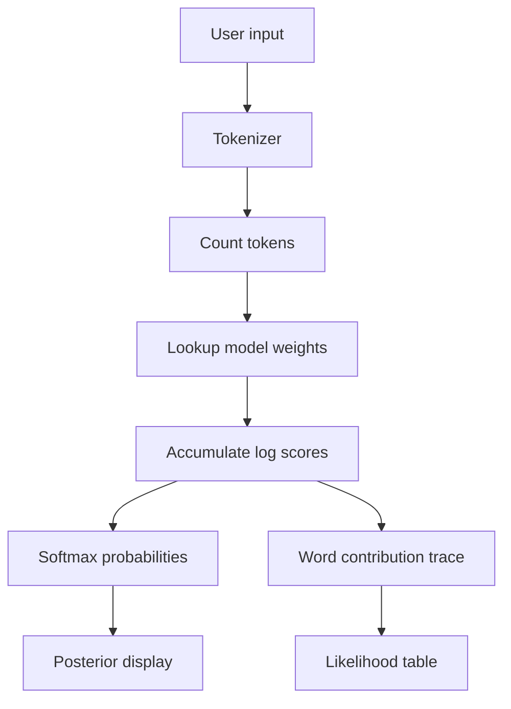

# BayesInspector


BayesInspector is a client-side probabilistic text classifier that exposes the full Naive Bayes reasoning chain, word by word, as you type. It is built to make the model feel inspectable instead of magical.

## What It Does

- Shows prior, likelihood, and posterior scores for every class.
- Highlights the words that actually move the prediction.
- Uses a custom TypeScript inference engine with no ML runtime dependencies.
- Runs entirely in the browser, so it works as a static site.

## Models

- Spam: 131 vocabulary entries, 2 classes
- News: 125 vocabulary entries, 5 classes (`tech`, `sports`, `politics`, `entertainment`, `health`)
- Sentiment: 105 vocabulary entries, 2 classes

The model files live in `src/data/` and are pre-baked JSON weights.

## Stack

- React 18 + TypeScript + Vite
- Framer Motion for motion and transitions
- Custom Naive Bayes inference in TypeScript
- Tailwind CSS tokens and a bespoke dark terminal-style UI

## Local Development

```bash
npm install
npm run dev
```

## Production Build

```bash
npm run build
```

Vite writes the production site to `dist/`.

## Cloudflare Pages

Use these settings when connecting the GitHub repo to Cloudflare Pages:

- Framework preset: None
- Build command: `npm run build`
- Build output directory: `dist`
- Root directory: leave blank, or point to the repository root
- Production branch: `main`

## Architecture



The classifier implements **Multinomial Naive Bayes** and also supports a Bernoulli variant for display logic.

```
log P(C|X) ∝ log P(C) + Σ count(xᵢ) × log P(xᵢ|C)
```

1. **Prior** computes `log P(C)` from the class priors.
2. **Likelihood** adds `count(xᵢ) × log P(xᵢ|C)` for every matched token.
3. **Posterior** normalises the log-scores with the log-sum-exp trick.

## Tokenisation Notes

- Normalises common leetspeak patterns like `g!ft`, `pr1ze`, and `webs1te`.
- Strips punctuation and possessives before lookup.
- Marks a short negation window so phrases like `not bad` can be modelled more robustly.

## Deployment Notes

- The app is static and does not require a backend.
- Cloudflare Pages can deploy it directly from GitHub.
- If you add client-side routing later, add a SPA fallback rewrite so refreshes keep working.

## Limitations

- Naive Bayes is still a bag-of-words model, so it does not truly understand sarcasm, long-range negation, or sentence intent.
- The updated preprocessing helps with common obfuscation and negation patterns, but borderline sentiment and ambiguous news text can still be misclassified.
- Those misses are expected for this model family and are part of the demo.

## License

No license file is currently provided in this repository.
